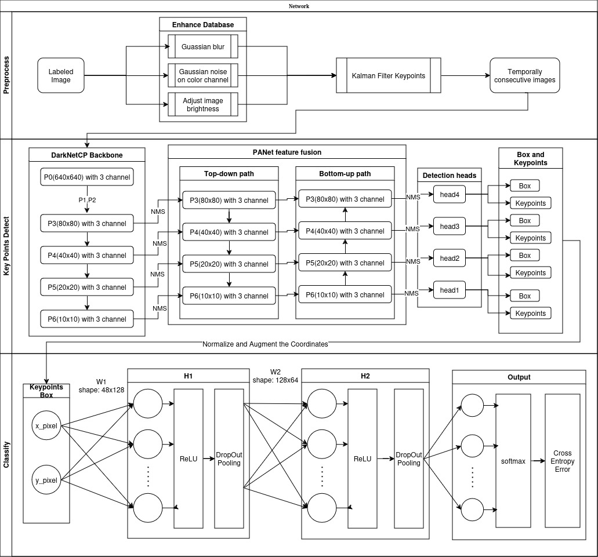

# Human Pose Classification

## Features

- Enhance by:

  - Applying Guassian blur to the original image to simulate camera autofocus, 
  - Adding Gaussan noise to the color channels to simulate color jitter
  - Adjusting the image brightness to simulate camera automatic exposure

- Preprocess image by:

  - Reducing calibrate errors by Kalman Filter
  - Adjusting training images to the appropriate resolution

- Train Keypoint detect model supported by YOLOv11

  >  The Newest model designed by Ultralytics[^1]

  - Bottom-up and Top-down Method
  - DarknetCP, PANet feature fusion

- Train Classification model

  - Using Drop out to reduce the complexity of the model
  - Using Xavier initialization
  - Using Elastic Net to regularization technology to analyze and refine the relationship between features to improve the generalization ability of the model
  - Coordinates Normalize
  - Using Label Smoothing to avoid overconfidence

## Preprocess

### Augmented Dataset

  In realistic usage, camera usually have problems such as autofocus failure, overexposure, and color jitter. In order to enhance the generalization ability of the model to adapt to these problems, I use Gaussian blur to simulate camera focus errors; add random, Gaussian-distributed noise to the three color channels to simulate color jitter, increase the brightness of the image to simulate overexposure.

  For Gaussian blur (also kown as Gaussian smoothing) is using Gaussian function to blurring an image. In pixel coordinate system, it is the product of two such Gaussian functions, one in each dimension:
$$
G(x,y)=\frac{1}{\sqrt{2\pi \sigma^2}}\exp(-\frac{x^2 + y^2}{2\sigma^2})
$$
where *x* is the distance from the origin in the horizontal axis, *y* is the distance from the origin in the vertical axis, and $\sigma$ is the standard deviation of the Gaussian distribution.

  For Guassian-distributed noise on three color channels, it's easy to understand that images consist of three channels: red, green and blue, therefore our object detector will take color information into account. In order to make our model more generalizable, I add a Gaussian distribution random bias to each color channel based on the original image.

### Kalman Filter

  Kalman filtering (also known as linear quadratic estimation) is an algorithm that uses a series of measurements observed over time. In the detection of human key points, under the premise that the dataset is a series of continuous action of the human body, these key points must be continuous in time series and meet certain kinematic laws. I expect our model can learn this regular pattern so that it can perform better in read-time detection. Therefore, it is feasible to use Kalman filter to preprocess the calibrated data.

  The Kalman filter model assumes the true state at time *k* is evolved from the state at (*k* − 1) according to
$$
x_k = \mathbf{F}_k x_{k-1} + w_k
$$
where $F_k$ is the state transition model which is applied to the previous state $x_{k-1}$, $w_k$ is the process noise, which is assumed to be drawn from a zero mean multivariate normal distribution, $\mathcal{N}$ , with covariance $Q_k$: $w_k \sim \mathcal{N}(0, Q_k)$.

  At time *k* an observation (or measurement) $z_k$ of the true state $x_k$ is made according to
$$
z_k = \mathbf{H}_kx_k + v_k
$$
where $H_k$ is the observation model, which maps the true state space into the observed space, $v_k$ is the observation noise, which is assumed to be zero mean Gaussian white noise with covariance $\mathbf{R_k}:\ v_k \sim \mathcal{N}(0, \mathbf{R}_k)$.

  I use kalman filter to estimate $\hat{x}_k$ by:
$$
\hat{x}_{k|k} = (\mathbf{I-\mathbf{K}_k\mathbf{H}_k})\hat{x}_{k|k-1} + \mathbf{K}_kz_k
$$
and use $\hat{x}$ instead of $x$ which we labeled in our database.

## YOLOv11

>  The Newest model designed by Ultralytics[^1]

  YOLO11 introduces significant improvements in architecture and training  methods, making it a versatile choice for a wide range of computer vision tasks.

  YOLO uses a novel heatmap-free approach for joint detection. They use *OKS* (*Object Keypoint Similarity*) to substitude *L1* loss used in heatmap approaches. Their new model learns to jointly detect bounding boxes for multiple personbs and their corresponding 2D poses in single forward pass and thus bringing in best of both top-down and bottom-up approaches.[^2]

## Classification Model

I use Multilayer Perceptron combined with pooling layers to classify different pose of human.

### Regularization

  Regularization is used to prevent model overfitting, improve the generalization ability of the model, and help select important features.

  Common weight decay algorithms now include L1 and L2 regularization. L1 regularization is sensitive to feature scaling, however this may cause features of different scales to be penalized to different degrees. L2 regularization shrinks the weights of all features but does not set them completely to zero, so feature selection cannot be achieved. Based on these condition, I use Elastic Net which combines L1 and L2 regularization, and can handle multicollinearity issues and performs well in the presence of correlated features:
$$
\mathcal{L}(\theta) = Loss(\theta) + \lambda_1\Sigma \theta_i + \lambda_2\Sigma\theta_i^2
$$

## Dropout

  Add Dropout layer after each hidden layer to calculate each inner layer while injecting noise and drop out some neurons during training. By this method, the generalization ability and robustness of the model is improved.

### Pooling

  In our key point training set, the coordinates of key points are often only within a certain range. This is due to the recording capabilities of the device and the computer's storage of image information. In order to make our model work properly at any resolution, we add a pooling layer after each Dropout layer to make the network robust to small translations in the input.

### Softmax

  We use a softmax operation to classify our keypoint boxes:
$$
softmax(o) = \frac{\exp(o_j)}{\sum_k\exp()o_k}
$$
and use cross entropy error as loss function:
$$
\mathcal{L}(\theta)=-\sum_{i=0}(y_i\log(p_i))
$$
where $y_i$ is the one-hot code, $p_i$ is the probability of each category predicted by the model.

# reference

[^1]:Glenn Jocher, “ultralytics/yolov5: v5.0 - YOLOv5-P6 1280 models, AWS, Supervise.ly and YouTube integrations”. Zenodo, Apr. 11, 2021. doi: 10.5281/zenodo.4679653.
[^2]: Maji D, Nagori S, Mathew M, et al. Yolo-pose: Enhancing yolo for multi  person pose estimation using object keypoint similarity  loss[C]//Proceedings of the IEEE/CVF Conference on Computer Vision and  Pattern Recognition. 2022: 2637-2646.